# Relatório Técnico — Tech Challenge Fase 1

**Projeto:** Classificação de tumores de mama (maligno vs. benigno) com Machine Learning
**Curso:** Pós-graduação em Inteligência Artificial — FIAP
**Repositório:** https://github.com/gustavofks/ML-breast-cancer

Código-fonte, notebooks executados e relatório visual acompanham este documento no repositório.
Todos os números apresentados são reproduzíveis com `python scripts/run_wisconsin.py`.

---

## Sumário

1. [O problema](#1-o-problema)
2. [Análise exploratória dos dados](#2-análise-exploratória-dos-dados)
3. [Estratégias de pré-processamento](#3-estratégias-de-pré-processamento)
4. [Modelos utilizados e justificativa](#4-modelos-utilizados-e-justificativa)
5. [Resultados e interpretação](#5-resultados-e-interpretação)
6. [Discussão crítica e uso na prática](#6-discussão-crítica-e-uso-na-prática)
7. [Entrega extra: diagnóstico por imagem com CNN](#7-entrega-extra-diagnóstico-por-imagem-com-cnn)

---

## 1. O problema

Uma rede de hospitais e centros de saúde especializados no atendimento à mulher busca implementar
um sistema inteligente de suporte ao diagnóstico, capaz de acelerar a triagem e apoiar decisões
clínicas diante de um volume crescente de pacientes.

Este projeto entrega a base de Machine Learning dessa solução: a classificação automática de
tumores de mama em **malignos** ou **benignos** a partir de características morfológicas de núcleos
celulares extraídas de imagens de punção aspirativa por agulha fina (PAAF).

**Base escolhida:** Breast Cancer Wisconsin (Diagnostic), disponível em
https://www.kaggle.com/datasets/uciml/breast-cancer-wisconsin-data — 569 amostras e 30
características numéricas, com diagnóstico confirmado.

A base descreve 10 medidas do núcleo celular (raio, textura, perímetro, área, suavidade,
compacidade, concavidade, pontos côncavos, simetria e dimensão fractal), cada uma em três
variantes: média da amostra (`_mean`), erro padrão da medida (`_se`) e média das três piores
células observadas (`_worst`).

**Premissa que orienta todo o projeto:** o modelo é ferramenta de triagem e segunda opinião. O
diagnóstico final é sempre responsabilidade do médico. Essa premissa define a métrica prioritária
(recall da classe maligna) e a exigência de explicabilidade das previsões.

---

## 2. Análise exploratória dos dados

Notebook correspondente: [`notebooks/01_exploratory_analysis.ipynb`](../notebooks/01_exploratory_analysis.ipynb)

### 2.1 Qualidade e integridade da base

A base tem 569 registros e **nenhum valor ausente real**. A única inconsistência encontrada é
estrutural: o cabeçalho do CSV termina em vírgula, o que faz o pandas criar uma coluna extra
`Unnamed: 32` inteiramente nula. Trata-se de artefato do arquivo, não de dado faltante — o
tratamento correto é descartar a coluna, e não imputar valores.

A coluna `id` também foi removida: é identificador do paciente, não tem relação causal com o
diagnóstico e, se mantida, permitiria ao modelo aprender ruído associado à ordem de coleta.

A variável alvo `diagnosis` é categórica (`M`/`B`) e foi codificada como **M = 1** e **B = 0**.
Maligno é a classe positiva por ser o evento que se deseja detectar e cujo erro tem maior custo
clínico.

### 2.2 Distribuição das classes

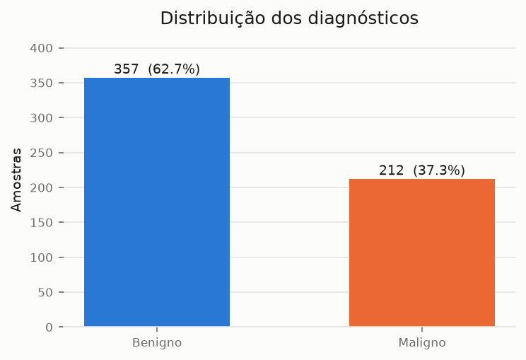

| Classe | Amostras | Proporção |
|---|---|---|
| Benigno | 357 | 62,7% |
| Maligno | 212 | 37,3% |

O desbalanceamento é leve e não exige reamostragem, mas tem duas consequências diretas:

1. **A acurácia isolada engana.** Um classificador que respondesse "benigno" para toda paciente já
   atingiria 62,7% de acurácia. Esse é o piso contra o qual qualquer resultado precisa ser
   comparado.
2. **A divisão treino/teste precisa ser estratificada**, preservando a proporção das classes nos
   dois conjuntos para que a avaliação continue representativa.

### 2.3 Escalas e assimetria

Duas características das features condicionam todo o pré-processamento:

- **Escalas radicalmente diferentes.** `area_worst` varia por milhares de unidades, enquanto
  `fractal_dimension_se` varia por centésimos — cerca de cinco ordens de grandeza de diferença.
  Algoritmos baseados em distância (KNN) ou em otimização com regularização (regressão logística)
  seriam dominados pelas variáveis de maior magnitude.
- **Assimetria à direita.** Várias features, principalmente as do grupo `_se`, apresentam cauda
  longa à direita: maioria das amostras em valores baixos e poucos casos com valores muito altos.
  Isso é esperado em medidas biológicas de tamanho e irregularidade.

### 2.4 Distribuições por diagnóstico

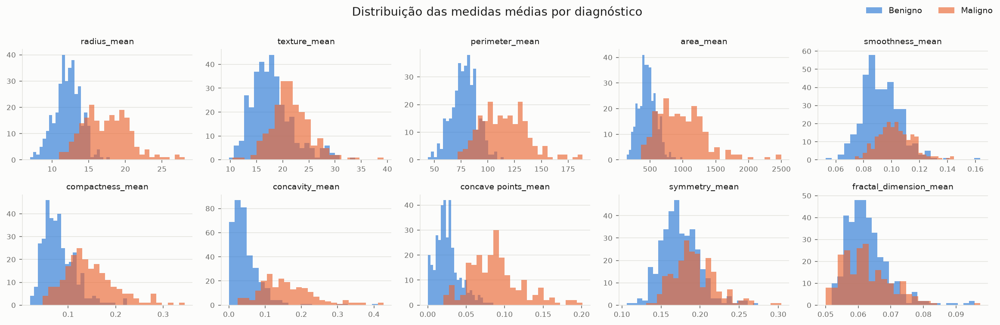

As medidas de tamanho e de irregularidade — `radius_mean`, `perimeter_mean`, `area_mean`,
`concavity_mean`, `concave points_mean` — mostram tumores malignos deslocados para valores mais
altos, com sobreposição apenas parcial entre as classes.

Já `smoothness_mean`, `symmetry_mean` e `fractal_dimension_mean` têm distribuições quase
sobrepostas: isoladamente, quase não distinguem os grupos.

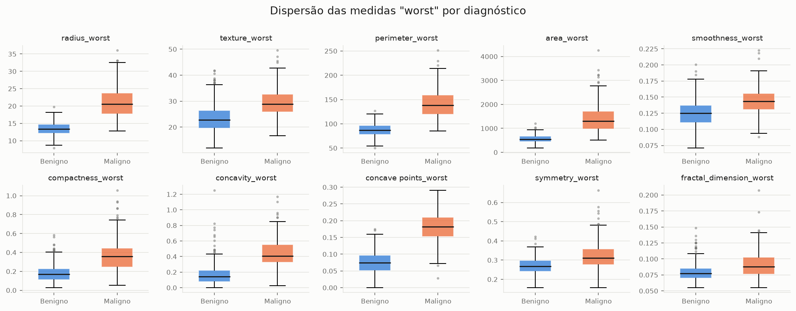

O grupo `_worst` separa as classes com mais nitidez que o grupo `_mean`. O achado tem sentido
clínico: o que caracteriza malignidade não é o comportamento médio do tecido, mas a existência de
células com morfologia mais agressiva — a "pior" célula da amostra é mais informativa que a célula
típica.

Os pontos fora dos bigodes são numerosos, mas **não são erros de medição**: são casos extremos
reais, concentrados na classe maligna. Removê-los descartaria justamente os casos mais graves,
exatamente os que o modelo precisa acertar. **Nenhum outlier foi removido neste projeto.**

### 2.5 Padrões relacionados ao diagnóstico

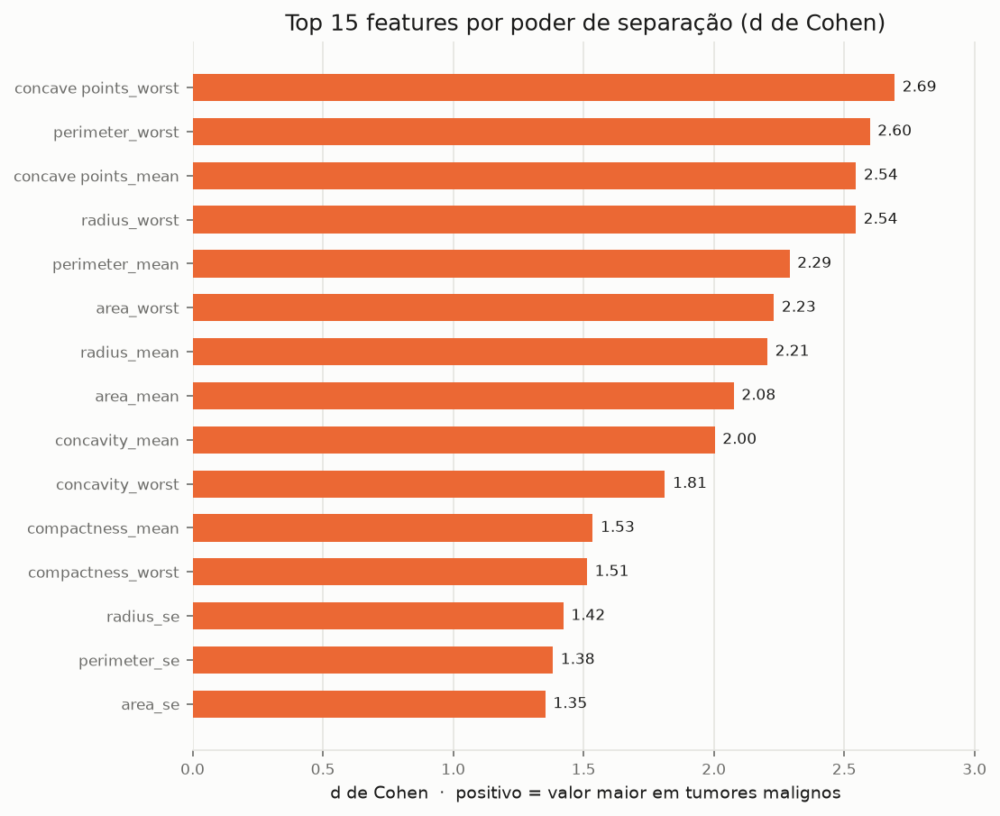

O *d* de Cohen mede a distância entre as médias das duas classes em unidades de desvio padrão. Por
ser adimensional, permite comparar features de escalas muito diferentes. Valores acima de 0,8 já
indicam efeito grande.

| Feature | Média benigno | Média maligno | *d* de Cohen |
|---|---|---|---|
| concave points_worst | 0,0744 | 0,1822 | 2,69 |
| perimeter_worst | 87,01 | 141,37 | 2,60 |
| concave points_mean | 0,0257 | 0,0880 | 2,54 |
| radius_worst | 13,38 | 21,13 | 2,54 |
| perimeter_mean | 78,08 | 115,37 | 2,29 |

Padrões identificados:

- **Concavidade e pontos côncavos lideram o ranking.** Medem o quanto o contorno do núcleo é
  irregular e reentrante — assinatura morfológica clássica de células malignas.
- **Medidas de tamanho vêm em seguida:** núcleos malignos são maiores.
- **Todos os *d* de Cohen do topo são positivos**, ou seja, os valores são sistematicamente maiores
  nos tumores malignos, sem inversão de sinal entre as principais features.
- **Textura, simetria e dimensão fractal** ficam no fim do ranking, com poder de separação fraco
  isoladamente — o que não impede contribuição em combinação com as demais.

Raio, perímetro e área descrevem essencialmente a mesma geometria, o que antecipa forte
multicolinearidade — quantificada na seção 3.

### 2.6 Síntese

| Achado | Consequência |
|---|---|
| Nenhum valor ausente real; só a coluna fantasma do CSV | Limpeza estrutural, sem imputação |
| `id` é identificador sem valor preditivo | Removida |
| Alvo categórico `M`/`B` | Codificado como M = 1 (positivo) e B = 0 |
| 62,7% benignos / 37,3% malignos | Acurácia isolada insuficiente; split estratificado |
| Escalas com até cinco ordens de grandeza de diferença | `StandardScaler` dentro do pipeline |
| Assimetria à direita, muitos outliers legítimos | Outliers preservados |
| Grupo `_worst` separa melhor que `_mean` | Confirmado depois pela importância dos modelos |
| Concavidade e tamanho lideram a separação | Coerente com a morfologia de células malignas |
| Raio, perímetro e área medem a mesma geometria | Multicolinearidade analisada na seção 3 |

---

## 3. Estratégias de pré-processamento

Código correspondente: [`src/preprocessing.py`](../src/preprocessing.py)

### 3.1 Limpeza aplicada

| Problema | Tratamento | Justificativa |
|---|---|---|
| Coluna `Unnamed: 32`, totalmente nula | Removida | Artefato da vírgula final no cabeçalho do CSV, não é dado faltante |
| Coluna `id` | Removida | Identificador do paciente, sem relação causal com o diagnóstico |
| Alvo `diagnosis` categórico (`M`/`B`) | Codificado como M = 1, B = 0 | Maligno é a classe positiva: é o evento a detectar |
| Outliers nas medidas morfológicas | **Preservados** | São casos malignos extremos reais, não erros de medição |
| Valores ausentes | Nenhum na base | Imputador de mediana mantido no pipeline por robustez |

A decisão de preservar outliers merece destaque: em uma base clínica, os valores extremos são
frequentemente os casos mais graves. Removê-los melhoraria as métricas de forma enganosa,
eliminando justamente as pacientes que o sistema mais precisa identificar.

### 3.2 Conversão de variáveis

As 30 features preditoras já são numéricas contínuas e não exigem codificação — não há variáveis
categóricas entre elas. A única variável categórica da base é o alvo, convertido para binário na
etapa de limpeza (`src/data.py`).

O que essas variáveis exigem não é codificação, e sim **padronização**, pela diferença de escala
descrita na seção 2.3.

### 3.3 Pipeline de pré-processamento

```
Pipeline
  ├── preprocessor
  │     ├── SimpleImputer(strategy="median")   # defensivo
  │     └── StandardScaler()                   # média 0, desvio padrão 1
  └── estimator                                # modelo da vez
```

**Por que o scaler fica dentro do pipeline.** Se fosse ajustado sobre a base completa antes da
separação treino/teste, a média e o desvio usados na transformação carregariam informação do
conjunto de teste — vazamento de dados (*data leakage*). O efeito é uma métrica otimista que não se
sustenta em produção. Dentro do `Pipeline`, o scaler é reajustado a cada fold da validação cruzada,
usando apenas os dados de treino daquele fold.

Efeito prático da padronização, no conjunto de treino:

| Feature | Média antes | Desvio antes | Média depois | Desvio depois |
|---|---|---|---|---|
| `area_worst` | 890,57 | 582,35 | 0 | 1 |
| `fractal_dimension_se` | 0,00377 | 0,00263 | 0 | 1 |

O imputador de mediana é preventivo: a base atual não tem valores ausentes, mas o pipeline
permanece válido caso novos dados cheguem incompletos, e a mediana é robusta à assimetria
observada na seção 2.3.

### 3.4 Análise de correlação

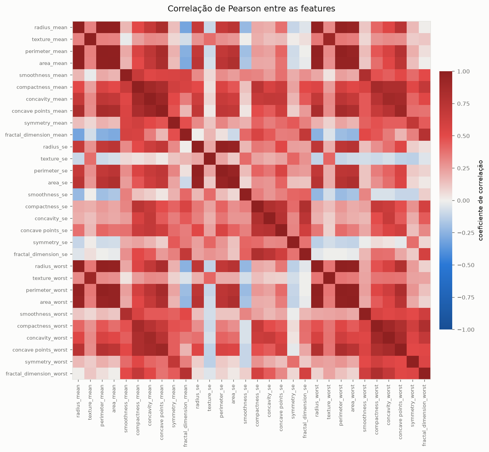

O mapa é dominado por correlações positivas: praticamente todas as features medem aspectos do
tamanho e da irregularidade do mesmo núcleo celular. As poucas correlações negativas relevantes
envolvem `fractal_dimension_mean`, que se comporta de forma inversa às medidas de tamanho.

**Multicolinearidade.** Existem **21 pares de features com correlação acima de 0,9**, e os extremos
são quase perfeitos:

| Par | Correlação |
|---|---|
| `radius_mean` × `perimeter_mean` | 0,998 |
| `radius_worst` × `perimeter_worst` | 0,994 |
| `radius_mean` × `area_mean` | 0,987 |
| `perimeter_mean` × `area_mean` | 0,987 |
| `radius_worst` × `area_worst` | 0,984 |

Isso não é acaso estatístico, é **geometria**: em uma forma aproximadamente circular, perímetro e
área são funções diretas do raio. As três variáveis medem a mesma grandeza em unidades diferentes.

Consequências por família de modelo:

- **Regressão logística** — a capacidade preditiva não é prejudicada, mas os coeficientes
  individuais ficam instáveis: o peso se distribui de forma arbitrária entre variáveis redundantes.
  A regularização L2 (padrão do scikit-learn) atenua o problema ao distribuir o peso de maneira
  estável, mas a *interpretação* de cada coeficiente isolado exige cautela.
- **KNN** — a mesma informação é contada várias vezes no cálculo da distância, dando peso excessivo
  à dimensão "tamanho do núcleo".
- **Random Forest** — robusta na predição, mas a importância nativa fica diluída: features
  redundantes dividem o crédito entre si e nenhuma parece tão relevante quanto de fato é. Esse é um
  dos motivos para complementar a análise com SHAP na seção 5.

**Decisão: nenhuma feature foi removida.** Com 569 amostras e 30 features, a base não sofre de alta
dimensionalidade, e a regularização já lida com a redundância. Seleção manual introduziria uma
escolha arbitrária sem ganho esperado de desempenho. A multicolinearidade fica registrada para
orientar a leitura dos coeficientes.

**Correlação com o alvo:**

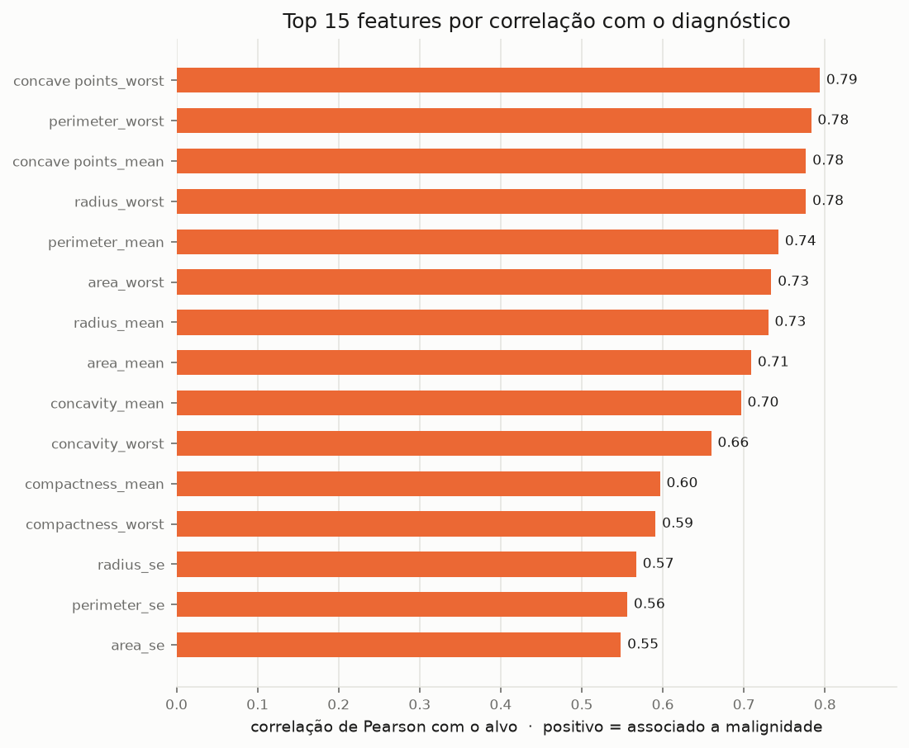

Como o alvo é binário, a correlação de Pearson equivale ao coeficiente ponto-bisserial. O ranking
reproduz quase exatamente o do *d* de Cohen — `concave points_worst` (0,79), `perimeter_worst`
(0,78) e `concave points_mean` (0,78) no topo. Duas métricas independentes chegando ao mesmo
resultado reforçam o achado.

Nenhuma feature isolada chega perto de correlação 1 com o diagnóstico: **não existe atalho de
variável única**, a classificação depende da combinação de várias medidas.

### 3.5 Separação treino/teste

Divisão de 80/20 com `stratify=y` e `random_state=42`:

| Conjunto | Amostras | Benigno | Maligno | Proporção maligno |
|---|---|---|---|---|
| Treino | 455 | 285 | 170 | 37,4% |
| Teste | 114 | 72 | 42 | 36,8% |
| *Base completa* | *569* | *357* | *212* | *37,3%* |

A estratificação mantém a proporção original nos dois conjuntos. Sem ela, a variação em uma base
deste tamanho poderia tornar o conjunto de teste não representativo.

O conjunto de teste permanece intocado até a avaliação final: toda a comparação entre modelos é
feita por validação cruzada estratificada de 5 folds **dentro do conjunto de treino**.

---

## 4. Modelos utilizados e justificativa

Código correspondente: [`src/models.py`](../src/models.py) ·
Notebook: [`notebooks/02_modeling_evaluation.ipynb`](../notebooks/02_modeling_evaluation.ipynb)

### 4.1 Modelos escolhidos

Foram avaliadas três técnicas com fundamentos distintos, para que a comparação seja informativa e
não apenas uma variação do mesmo viés:

| Modelo | Como decide | Por que foi incluído |
|---|---|---|
| **Regressão Logística** | combinação linear das features passada por uma sigmoide | baseline interpretável — cada coeficiente indica quanto uma medida empurra a previsão, o que é essencial em contexto clínico |
| **KNN** | classe majoritária entre os *k* casos mais parecidos | não paramétrico, não assume forma da fronteira de decisão; depende fortemente de escala, o que evidencia o efeito da padronização |
| **Random Forest** | votação de muitas árvores treinadas em amostras diferentes | captura relações não lineares e interações entre medidas; fornece importância de variáveis nativa |

Todos são `Pipeline` completos (pré-processamento + estimador), o que garante que a padronização
seja reajustada dentro de cada fold da validação cruzada.

### 4.2 Escolha da métrica

O problema é clínico e assimétrico: **os dois tipos de erro não custam a mesma coisa.**

| Erro | Significado clínico | Consequência |
|---|---|---|
| **Falso negativo** | tumor maligno classificado como benigno | paciente vai para casa sem tratamento; o diagnóstico atrasa |
| **Falso positivo** | tumor benigno classificado como maligno | exames adicionais, ansiedade, custo |

Um falso negativo é incomparavelmente mais grave. Por isso a **métrica prioritária é o recall da
classe maligna** — a fração de tumores malignos que o modelo consegue capturar.

Duas ressalvas definem o protocolo adotado:

- **A acurácia não decide.** Com 62,7% de casos benignos, um classificador que respondesse "benigno"
  sempre atingiria 62,7% de acurácia com recall zero. A acurácia é reportada, nunca isolada.
- **Recall puro também não decide a escolha do modelo.** Otimizar apenas recall premiaria um
  classificador que chama quase tudo de maligno — recall 100%, precisão baixa, inútil na triagem.
  Por isso a *seleção* do modelo usa **F1** (média harmônica entre precisão e recall), e o recall é
  otimizado depois, pelo ajuste do limiar de decisão (seção 5.4).

### 4.3 Protocolo de validação

- Divisão estratificada 80/20, com o conjunto de teste **intocado** até a avaliação final
- Comparação entre modelos por **validação cruzada estratificada de 5 folds dentro do treino**
- Ajuste de hiperparâmetros por busca em grade pequena, otimizando F1 na mesma validação cruzada
- Semente fixa (`random_state=42`) em todas as etapas, para reprodutibilidade

Resultados da validação cruzada (conjunto de treino, 455 amostras):

| Modelo | Acurácia | Precisão | Recall | F1 | AUC |
|---|---|---|---|---|---|
| **Regressão Logística** | 0,974 | 0,977 | **0,953** | **0,964** | 0,996 |
| KNN | 0,965 | 0,988 | 0,918 | 0,951 | 0,987 |
| Random Forest | 0,960 | 0,958 | 0,935 | 0,946 | 0,988 |

A regressão logística lidera em F1 e recall, com desvio padrão baixo entre os folds — resultado
estável, não fruto de uma partição favorável. O KNN tem a maior precisão (0,988) e o menor recall
(0,918): é conservador, erra pouco quando afirma "maligno", mas deixa passar mais casos malignos.
Para este problema, é a troca errada.

**Um modelo linear vencendo dois não lineares é informativo:** indica que, após a padronização, as
classes são quase linearmente separáveis no espaço das 30 features. Isso é coerente com a análise
exploratória, que mostrou várias medidas fortemente deslocadas entre os grupos e nenhuma interação
complexa aparente.

Ajuste de hiperparâmetros:

| Modelo | Melhores parâmetros | F1 na validação |
|---|---|---|
| Regressão Logística | `C = 1,0` | 0,964 |
| KNN | `n_neighbors = 3`, `weights = uniform` | 0,963 |
| Random Forest | `max_depth = 6`, `min_samples_leaf = 1`, `n_estimators = 200` | 0,952 |

O ajuste altera pouco: a regressão logística já estava no `C` padrão; o KNN melhora ao reduzir *k*
de 5 para 3; a Random Forest melhora ao limitar a profundidade, sinal de leve sobreajuste. Nenhum
ganho muda a ordem entre os modelos, o que reforça que a diferença vem da natureza de cada
algoritmo, e não de configuração.

**Modelo escolhido: Regressão Logística.**

---

## 5. Resultados e interpretação

### 5.1 Desempenho no conjunto de teste

Primeiro e único uso dos 114 casos separados no início.

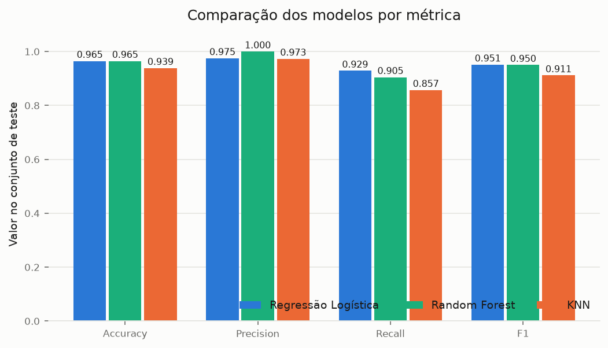

| Modelo | Acurácia | Precisão | Recall | F1 | AUC | Falsos negativos |
|---|---|---|---|---|---|---|
| **Regressão Logística** | 0,965 | 0,975 | **0,929** | **0,951** | **0,996** | **3** |
| Random Forest | 0,965 | 1,000 | 0,905 | 0,950 | 0,995 | 4 |
| KNN | 0,939 | 0,973 | 0,857 | 0,911 | 0,983 | 6 |

O desempenho no teste confirma o da validação cruzada, sem queda relevante — não há sinal de
sobreajuste.

A Random Forest alcança precisão perfeita (nenhum falso positivo), mas com 4 falsos negativos.
**Trocar um falso positivo por um falso negativo é um mau negócio neste contexto:** o primeiro custa
um exame adicional, o segundo custa um diagnóstico perdido.

### 5.2 Matriz de confusão

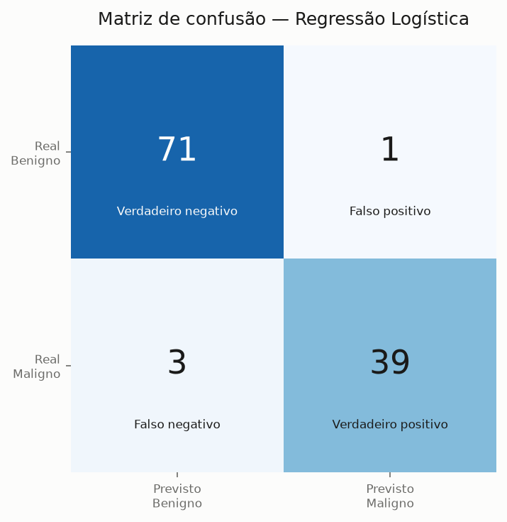

O modelo escolhido acerta 110 dos 114 casos:

| Quadrante | Casos | Leitura clínica |
|---|---|---|
| Verdadeiros negativos | 71 | tumores benignos corretamente identificados |
| Verdadeiros positivos | 39 | tumores malignos corretamente identificados |
| Falsos positivos | 1 | uma paciente encaminhada a exames adicionais desnecessários |
| **Falsos negativos** | **3** | **três tumores malignos classificados como benignos** |

Os três falsos negativos são o número que importa. Com recall de 0,929, o modelo deixa passar cerca
de 1 em cada 14 tumores malignos — bom para um sistema de apoio, **inaceitável para decisão
autônoma**.

### 5.3 Curvas ROC

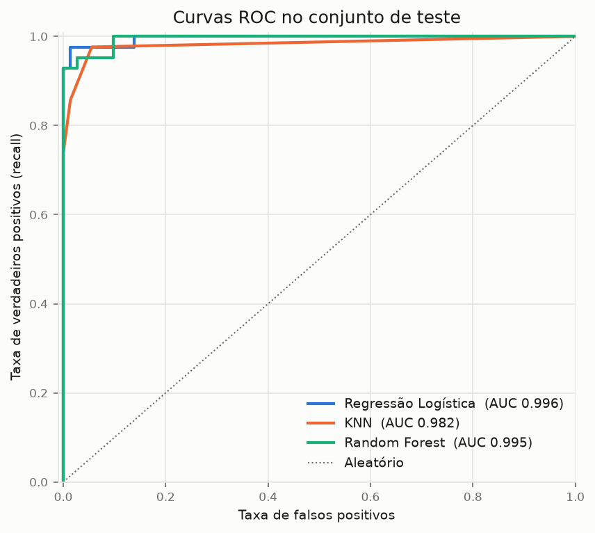

As três curvas ficam próximas do canto superior esquerdo, com AUC entre 0,983 e 0,996. A AUC mede a
capacidade de ordenar corretamente os casos por risco, independentemente do limiar.

AUC de 0,996 combinada a recall de 0,929 no limiar padrão revela algo importante: **o modelo separa
bem as classes; o que está mal calibrado é o corte.**

### 5.4 Ajuste do limiar de decisão

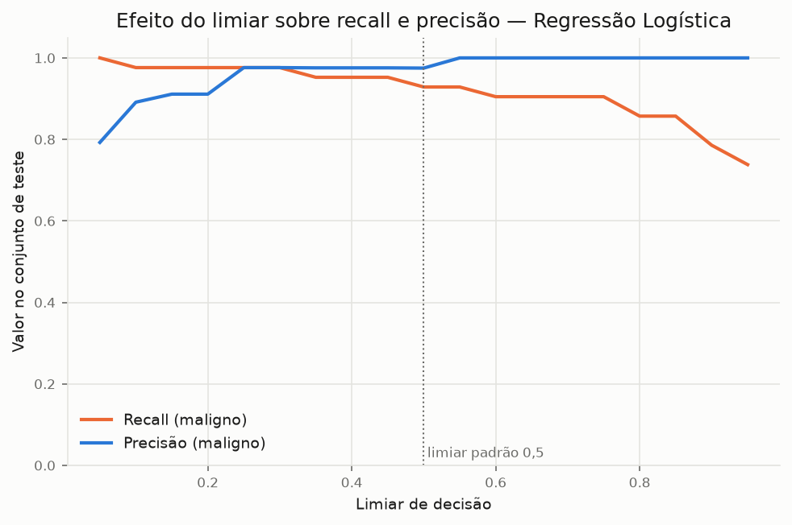

O limiar de 0,5 é apenas a convenção do `predict()`, não uma escolha clínica. Baixá-lo para **0,30**
melhora todas as métricas simultaneamente:

| Limiar | Recall | Precisão | F1 | Falsos negativos | Falsos positivos |
|---|---|---|---|---|---|
| 0,50 (padrão) | 0,929 | 0,975 | 0,951 | 3 | 1 |
| **0,30** | **0,976** | **0,976** | **0,976** | **1** | 1 |

Em termos clínicos: duas pacientes a mais com tumor maligno seriam corretamente sinalizadas, sem
aumento de exames desnecessários.

Duas ressalvas honestas sobre esse resultado:

1. **O conjunto de teste tem 114 casos.** Uma diferença de dois falsos negativos é estatisticamente
   frágil e pode não se repetir em outra amostra. O limiar ideal deveria ser calibrado por validação
   cruzada no treino, e não escolhido observando o teste — caso contrário, ajusta-se ao próprio
   conjunto de avaliação.
2. **A direção do ajuste é defensável independentemente do valor exato.** Como o custo de um falso
   negativo é muito maior que o de um falso positivo, um limiar abaixo de 0,5 é a escolha racional
   para triagem, ainda que o ótimo preciso varie.

### 5.5 Explicabilidade

Código correspondente: [`src/explain.py`](../src/explain.py)

Um sistema de apoio ao diagnóstico que não explica sua previsão não é utilizável na prática: o
médico precisa poder concordar ou discordar com base no raciocínio, não apenas no número. Foram
aplicadas três técnicas complementares:

| Técnica | O que responde | Limitação |
|---|---|---|
| **Coeficientes** | direção e força de cada medida no modelo linear | sofre com multicolinearidade; só vale para modelos lineares |
| **Importância por permutação** | quanto o desempenho piora sem aquela medida | agnóstica ao modelo, mas apenas global |
| **SHAP** | quanto cada medida contribuiu para *esta* paciente | custo computacional maior |

#### Coeficientes da regressão logística

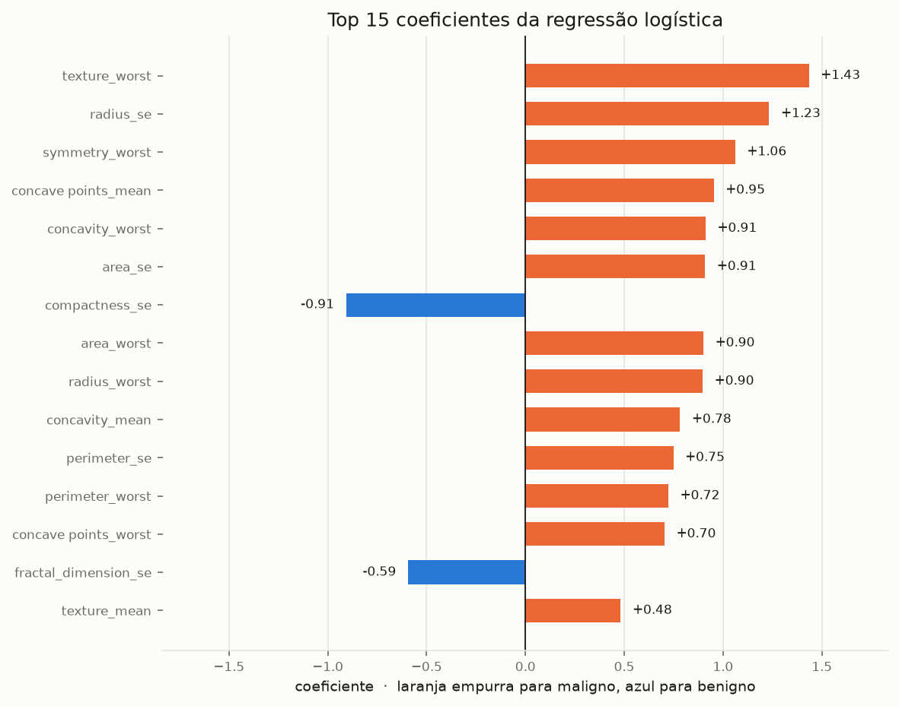

| Feature | Coeficiente | Razão de chances |
|---|---|---|
| `texture_worst` | +1,434 | 4,20 |
| `radius_se` | +1,233 | 3,43 |
| `symmetry_worst` | +1,061 | 2,89 |
| `concave points_mean` | +0,953 | 2,59 |
| `concavity_worst` | +0,911 | 2,49 |

Como as features estão padronizadas, os coeficientes são comparáveis entre si e a razão de chances
tem leitura direta: um aumento de um desvio padrão em `texture_worst` multiplica por ~4,2 a chance
de o tumor ser maligno, mantidas as demais medidas constantes.

**Um resultado aparentemente contraditório merece explicação.** O maior coeficiente é
`texture_worst`, e não `concave points_worst`, que liderava tanto o *d* de Cohen quanto a correlação
com o alvo. A causa é a multicolinearidade documentada na seção 3.4: `concave points_worst` é
altamente correlacionada com várias outras medidas de tamanho e contorno, e a regularização L2
distribui o peso entre todas elas, de modo que nenhuma recebe isoladamente um coeficiente grande.
`texture_worst`, por ser relativamente independente das demais, carrega informação que nenhuma outra
feature fornece — e por isso recebe peso alto.

A lição de interpretação: **coeficiente alto significa "informação única e útil ao modelo", não
"medida mais importante clinicamente".** Coeficientes isolados não bastam.

#### Importância por permutação

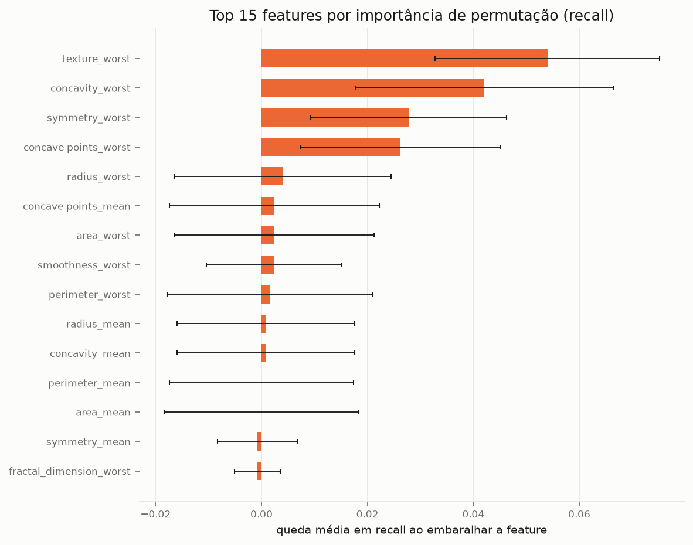

| Feature | Queda média em recall | Desvio |
|---|---|---|
| `texture_worst` | 0,0540 | 0,0212 |
| `concavity_worst` | 0,0421 | 0,0243 |
| `symmetry_worst` | 0,0278 | 0,0185 |
| `concave points_worst` | 0,0262 | 0,0188 |
| `radius_worst` | 0,0040 | 0,0205 |

A permutação mede o impacto real sobre o desempenho: embaralhar `texture_worst` derruba o recall em
5,4 pontos percentuais. Depois das quatro primeiras features, a queda cai a praticamente zero — **o
modelo se apoia em poucas medidas**, e as demais são redundantes ou irrelevantes.

A métrica usada foi o recall, e não a acurácia. A escolha importa: uma feature pode ser importante
para a acurácia geral e irrelevante para detectar casos malignos, que é o objetivo aqui.

Ressalva: o desvio padrão é grande em relação à queda média, consequência dos 114 casos de teste. Os
rankings devem ser lidos como indicativos, não como ordem precisa.

#### SHAP — visão global

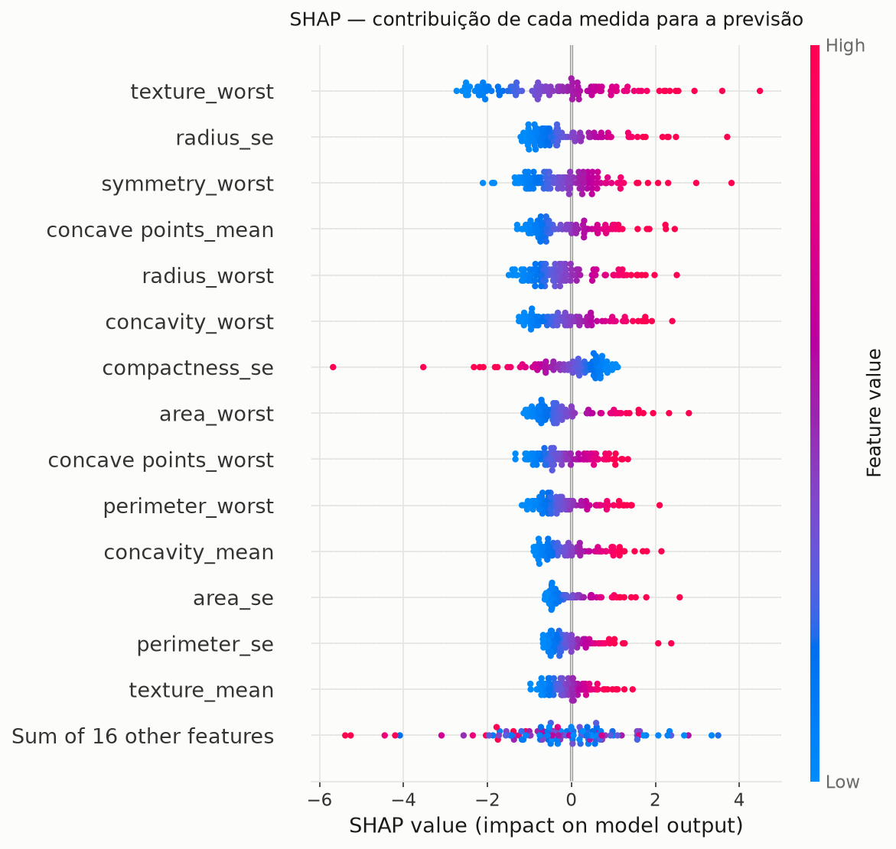

Cada ponto é uma paciente. A posição horizontal mostra o quanto aquela medida empurrou a previsão
para maligno (direita) ou benigno (esquerda); a cor indica se o valor era alto (vermelho) ou baixo
(azul).

O padrão é consistente e clinicamente coerente: para quase todas as features do topo, **valores
altos empurram para maligno**. Núcleos maiores, mais irregulares e com contorno mais reentrante
aumentam a probabilidade prevista de malignidade — exatamente o que a literatura médica descreve.

A exceção é `compactness_se`, cujo padrão se inverte. Trata-se de efeito de compensação estatística
entre variáveis correlacionadas, não de achado clínico — o tipo de resultado que exige cautela antes
de virar afirmação médica.

#### SHAP — um caso individual

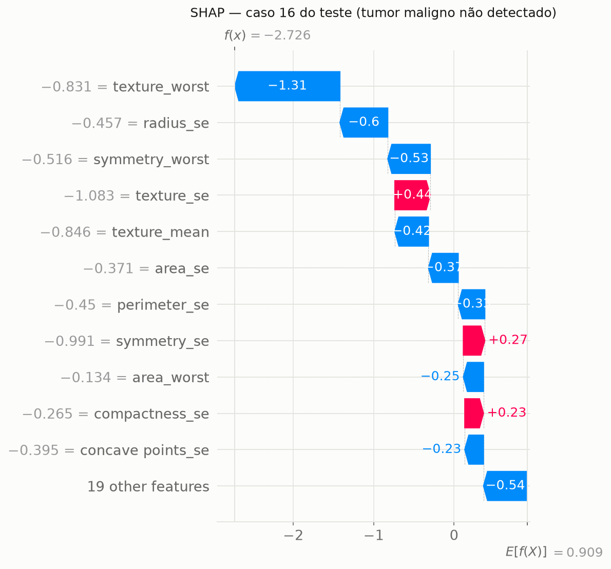

Este é um dos três tumores malignos classificados como benignos. A decomposição mostra exatamente
por que o modelo errou: **praticamente todas as medidas desta paciente estão abaixo da média** da
base — `texture_worst` a −0,83 desvios padrão, `texture_mean` a −0,85, `symmetry_worst` a −0,52,
`area_worst` a −0,13. Cada uma empurrou a previsão para "benigno".

Em linguagem clínica: é um tumor maligno cujos núcleos celulares têm morfologia pouco
característica. **O modelo não cometeu um erro aleatório** — viu um caso que genuinamente se parece
com os benignos nas 30 medidas disponíveis.

Duas implicações diretas para o uso na prática:

1. **O modelo não substitui o médico.** Existem tumores malignos morfologicamente discretos, e
   nenhum ajuste de hiperparâmetro resolve isso: a informação necessária não está nas features.
2. **A explicação é acionável.** Um médico que vê esta decomposição sabe que a previsão "benigno" se
   apoia em medidas fracas, sem nenhum sinal forte em contrário. Isso é qualitativamente diferente
   de um caso benigno com evidência robusta, e justifica exames complementares.

#### Convergência das três técnicas

`texture_worst`, `concavity_worst`, `symmetry_worst` e `concave points` aparecem no topo das três
análises, obtidas por caminhos matematicamente independentes. A concordância aumenta a confiança de
que o modelo aprendeu sinal real, e não artefato da partição de dados.

---

## 6. Discussão crítica e uso na prática

### 6.1 O modelo pode ser usado na prática?

**Sim, como ferramenta de apoio — não como decisor.** O desempenho sustenta essa afirmação: recall
de 0,929 e AUC de 0,996 no conjunto de teste, sem queda em relação à validação cruzada, com
explicações coerentes com a morfologia celular descrita na literatura médica. Mas o mesmo conjunto
de resultados delimita com precisão onde o uso autônomo seria irresponsável.

Três limitações são intransponíveis com esta base:

**1. Origem única e volume pequeno.** São 569 casos de uma única instituição, coletados sob um
único protocolo. Nada garante que o desempenho se mantenha em outra população, com outro
equipamento ou outro patologista extraindo as medidas. O conjunto de teste tem 114 casos — a
diferença entre 3 e 1 falso negativo, que sustenta a recomendação de ajuste do limiar, equivale a
duas pacientes. É uma base pequena demais para decisões definitivas.

**2. O sistema não parte de dados crus.** As 30 features já são o resultado de uma etapa anterior de
análise por um especialista, que examinou a imagem da punção e mediu os núcleos celulares. O modelo
automatiza o *julgamento* a partir das medidas, não a *extração* das medidas. Na prática, isso
significa que ele não reduz a carga de trabalho especializada — apenas apoia a decisão final. A
entrega extra deste projeto, com CNN sobre mamografias, ataca justamente essa limitação.

**3. Existem tumores malignos morfologicamente discretos.** A análise SHAP do caso 16 do conjunto de
teste mostrou um tumor maligno cujas medidas estão quase todas abaixo da média da base. O modelo não
errou por acaso: viu um caso que genuinamente se parece com os benignos nas variáveis disponíveis.
Nenhum ajuste de hiperparâmetro resolve isso, porque a informação necessária não está nos dados.

### 6.2 Como o modelo seria usado

Três cenários concretos, em ordem crescente de exigência:

| Cenário | Como funcionaria | Por que agrega valor |
|---|---|---|
| **Priorização de fila** | ordenar os casos pendentes pela probabilidade prevista de malignidade | casos de alto risco chegam antes ao especialista; ninguém é excluído da análise |
| **Segunda opinião** | exibir previsão, probabilidade e explicação SHAP junto ao laudo em elaboração | oferece um contraponto estruturado antes da assinatura |
| **Sinalização de discordância** | alertar quando modelo e laudo preliminar divergem | atua como rede de segurança contra desatenção, não como substituto do julgamento |

Em todos, **o laudo é assinado por um médico**. O sistema nunca emite diagnóstico, nunca dispensa
uma paciente e nunca é a última etapa do fluxo.

### 6.3 O limiar de decisão é uma escolha clínica, não técnica

O limiar padrão de 0,5 vem da convenção do `predict()`, não de nenhuma consideração médica. Este
projeto mostrou que 0,30 reduz os falsos negativos de 3 para 1 sem aumentar os falsos positivos —
mas o ponto mais importante é outro: **quem deve escolher esse valor é a instituição de saúde, não o
cientista de dados**, porque a escolha traduz uma decisão de política clínica sobre quantos exames
adicionais se aceita realizar para não deixar um tumor maligno passar.

O que a análise técnica entrega é a curva de trade-off (seção 5.4), que torna essa decisão informada
em vez de arbitrária.

### 6.4 Riscos de implantação

- **Excesso de confiança.** Um sistema que acerta 96,5% das vezes pode induzir o profissional a
  aceitar previsões sem revisar — justamente o efeito que a explicabilidade busca combater ao expor
  o raciocínio por trás de cada resposta.
- **Degradação silenciosa.** Mudanças de equipamento, protocolo ou população deslocam a distribuição
  dos dados sem gerar nenhum erro visível. Uso em produção exigiria monitoramento contínuo das
  métricas e recalibração periódica.
- **Interpretação equivocada da importância das variáveis.** Como demonstrado na seção 5.5,
  `texture_worst` tem o maior coeficiente por ser pouco correlacionada com as demais, não por ser
  clinicamente mais relevante. Comunicar isso como "a textura é o que mais importa no diagnóstico"
  seria um erro grave de tradução entre estatística e medicina.
- **Responsabilidade legal e ética.** Um sistema de apoio ao diagnóstico opera sobre dados sensíveis
  de saúde e influencia decisões médicas. Implantação real exigiria conformidade com a LGPD,
  rastreabilidade das previsões e definição explícita de responsabilidade sobre o desfecho.

### 6.5 Próximos passos técnicos

1. **Validação externa** em base de outra instituição — o teste decisivo que esta base não permite.
2. **Calibração do limiar por validação cruzada no treino**, em vez de observação do conjunto de
   teste, eliminando o risco de ajuste ao próprio conjunto de avaliação.
3. **Calibração de probabilidade** (Platt scaling ou isotônica), para que o valor previsto possa ser
   lido como risco real e não apenas como ordenação.
4. **Diagnóstico a partir de imagem** com redes neurais convolucionais, removendo a dependência da
   extração manual de medidas — a entrega extra deste desafio.

### 6.6 Conclusão

O projeto entrega um classificador com desempenho alto, estável e explicável, construído sobre um
protocolo metodológico defensável: sem vazamento de dados, com separação clara entre treino e teste,
métrica escolhida pelo custo clínico do erro e três técnicas independentes de explicabilidade
convergindo nos mesmos achados.

Seu valor prático não está em substituir o julgamento médico, mas em **tornar esse julgamento mais
rápido e mais informado** — priorizando filas, oferecendo segunda opinião estruturada e sinalizando
divergências. O caso do tumor maligno não detectado, dissecado pela análise SHAP, é o argumento mais
concreto a favor dessa posição: existem limites que o dado disponível não permite ultrapassar, e
reconhecê-los faz parte de entregar o sistema de forma responsável.

---

## 7. Entrega extra: diagnóstico por imagem com CNN

Código correspondente: [`src/vision/`](../src/vision/) · Execução: `python scripts/run_vision.py`

A seção 6.1 apontou uma limitação central do pipeline tabular: **ele não parte de dados crus.** As
30 features do Wisconsin já são resultado de um especialista ter examinado a imagem e medido os
núcleos celulares. Esta entrega ataca exatamente essa limitação, classificando a partir do pixel.

### 7.1 A base

**BUSI — Breast Ultrasound Images** (Al-Dhabyani et al., 2020), licença CC BY 4.0. São 780 imagens
de ultrassom mamário de 600 pacientes, em três classes. O enunciado do desafio autoriza
explicitamente imagens de mamografia **ou ultrassom**.

| Classe | Imagens | Proporção |
|---|---|---|
| benign | 437 | 56,0% |
| malignant | 210 | 26,9% |
| normal | 133 | 17,1% |

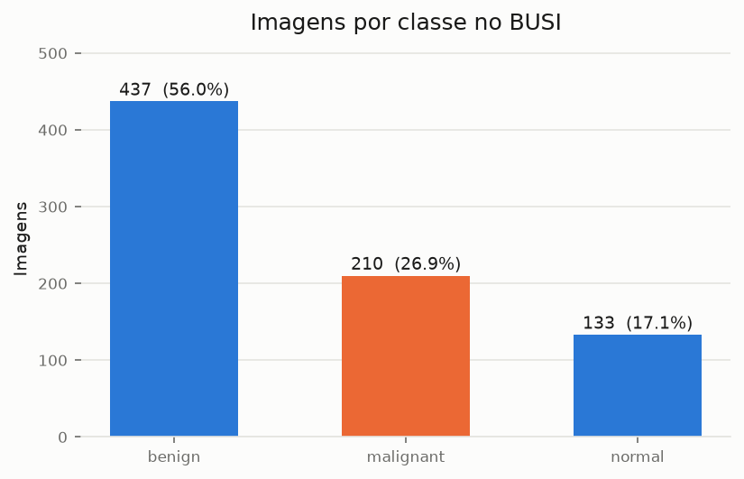

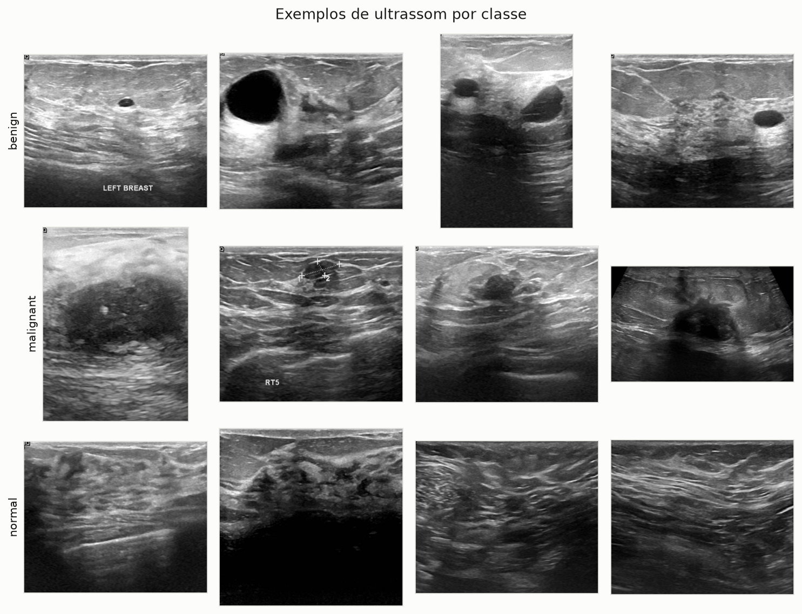

**Uma armadilha do dataset que valeu registro.** O BUSI distribui as máscaras de segmentação
(`*_mask.png`) na mesma pasta das imagens — são 798 arquivos. O carregador do Keras lê tudo o que
encontra no diretório: mantidas ali, as máscaras entrariam como se fossem exames, dobrando o
conjunto com imagens binárias que não existem clinicamente e inflando as métricas sem sentido. O
carregamento detecta máscaras e **interrompe com instrução explícita**, em vez de treinar sobre um
conjunto silenciosamente contaminado.

### 7.2 Duplicatas: o problema que precedeu qualquer métrica

Antes de reportar desempenho foi preciso resolver um defeito da base. O BUSI contém vários quadros
do mesmo exame, praticamente indistinguíveis entre si. Uma auditoria por *hash* perceptual — que
compara miniaturas em tons de cinza e tolera diferenças de compressão — encontrou o seguinte:

| Verificação | Resultado |
|---|---|
| Imagens | 780 |
| Grupos de imagens distintas | 668 |
| Grupos com mais de um quadro | 95 |
| Imagens redundantes | 112 |
| Grupos com **rótulos contraditórios** | 7 |

Dois achados exigem comentário. O primeiro: **112 das 780 imagens são repetições** de exames já
presentes na base. Distribuídas ao acaso, 62 pares caíam em partições diferentes — a rede era
avaliada em imagens que já tinha visto no treino. É vazamento de dados, exatamente o problema que o
pipeline tabular evita ao manter o `StandardScaler` dentro do `Pipeline`.

O segundo: **7 grupos têm rótulos contraditórios** — imagens praticamente idênticas catalogadas com
diagnósticos diferentes, incluindo um par byte a byte igual que aparece como `benign (433)` e como
`malignant (145)`. Não há como decidir qual rótulo está correto sem acesso ao laudo original, então
os casos foram mantidos e registrados: representam um limite de qualidade da base, não do modelo.

A correção foi tratar cada grupo como uma unidade indivisível na partição. `StratifiedGroupKFold`
atende às duas exigências ao mesmo tempo: preserva a proporção das classes e nunca separa um grupo.

### 7.3 Protocolo

- Divisão **estratificada e agrupada** — 556 imagens de treino, 112 de validação e 112 de teste,
  com nenhum grupo de quadros repetidos dividido entre conjuntos
- Proporção de casos malignos: 27,0% no treino, 26,8% na validação e 26,8% no teste, contra 26,9%
  na base completa
- Imagens redimensionadas para 224×224, entrada padrão das redes pré-treinadas
- **Pesos de classe** inversamente proporcionais à frequência, para que a rede não aprenda a
  favorecer a classe majoritária
- Aumento de dados apenas geométrico — espelhamento, rotação leve, zoom e translação. Distorções de
  cor seriam arriscadas: em imagem médica, a intensidade carrega informação diagnóstica
- Parada antecipada monitorando a perda de validação, com restauração dos melhores pesos
- **Execução determinística**: sementes fixas e `enable_op_determinism()`. Sem isso, cada execução
  produzia métricas diferentes, porque inicialização de pesos, embaralhamento e aumento de dados
  usam geradores próprios

### 7.4 Arquiteturas comparadas

| Modelo | Parâmetros | Ideia |
|---|---|---|
| **CNN do zero** | 110 mil | três blocos convolucionais treinados apenas com as 556 imagens disponíveis |
| **MobileNetV2 (transferência)** | 2,26 milhões | base pré-treinada na ImageNet, congelada, com cabeça de classificação nova |
| **MobileNetV2 (ajuste fino)** | 2,26 milhões | segunda etapa: as 60 camadas finais da base são liberadas, com taxa de aprendizado 10× menor |

O ajuste fino só faz sentido **depois** que a cabeça converge com a base congelada. Aplicado a pesos
aleatórios, os gradientes iniciais destruiriam as features pré-treinadas. Três cuidados tornam a
etapa segura: apenas as camadas finais são liberadas — as primeiras detectam bordas e texturas úteis
em qualquer imagem —, a taxa de aprendizado cai de 1e-3 para 1e-4, e as camadas de normalização em
lote permanecem congeladas, porque atualizar suas estatísticas com lotes pequenos degradaria a
normalização aprendida em milhões de imagens.

### 7.5 Resultados

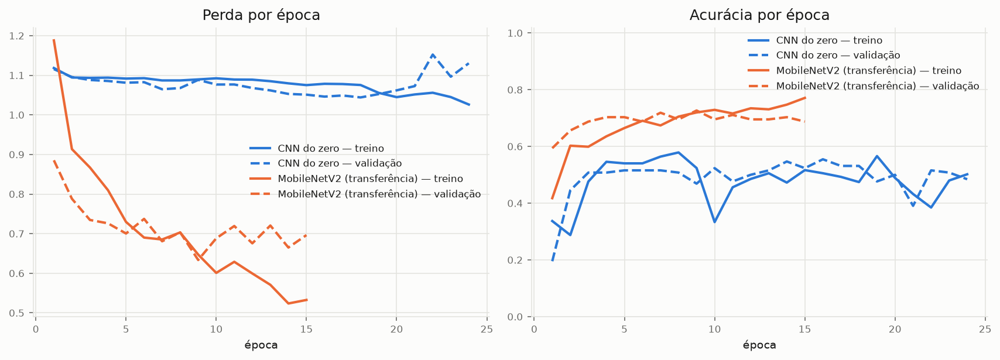

| Modelo | Épocas | Melhor época | Acurácia | F1 macro | **Recall maligno** | Precisão maligno | Malignos não detectados | Tempo |
|---|---|---|---|---|---|---|---|---|
| **MobileNetV2 (ajuste fino)** | 12 | 6 | **0,839** | **0,821** | **0,900** | **0,771** | **3 de 30** | 78 s |
| MobileNetV2 (transferência) | 26 | 20 | 0,759 | 0,751 | 0,767 | 0,622 | 7 de 30 | 140 s |
| CNN do zero | 14 | 8 | 0,563 | 0,240 | 0,000 | 0,000 | 30 de 30 | 97 s |

**A CNN treinada do zero não aprendeu a tarefa.** Com 56,3% de acurácia, ela não detectou nenhum
dos 30 casos malignos: aprendeu a responder "benigno", que é a resposta mais frequente. É a
demonstração prática do que a seção 2 já afirmava sobre a acurácia como métrica isolada — um modelo
pode exibir mais de metade de acerto e ter valor clínico zero. As curvas confirmam: sua perda de
validação mal se move ao longo de 14 épocas. Com 556 imagens, não há dados suficientes para aprender
filtros visuais a partir do zero.

**A transferência de aprendizado é o que torna a tarefa viável**, e o ajuste fino é o que a torna
razoável: liberar as camadas finais elevou o recall da classe maligna de 0,767 para **0,900**,
reduzindo de 7 para 3 os casos não detectados, e ainda assim melhorou a precisão. As features da
ImageNet servem de ponto de partida, mas texturas de ultrassom não se parecem com fotografias
naturais — adaptá-las é o que faz diferença.

Duas notas de método que valem mais que os números. A primeira: uma tentativa conservadora de ajuste
fino (40 camadas, taxa 1e-5) não moveu os pesos e parou na primeira época; a configuração precisa
ser testada, não presumida. A segunda: a primeira implementação continha um defeito silencioso — a
busca pela base pré-treinada usava `isinstance(camada, Model)`, e a camada de aumento de dados é um
`Sequential`, que também é um `Model`, de modo que o código liberava o bloco de aumento em vez da
MobileNetV2. Nada acusava erro. Um teste exigindo que as camadas liberadas pertençam à base expôs o
problema.

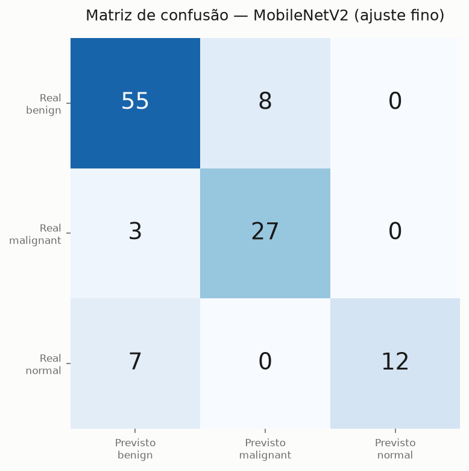

A matriz do modelo escolhido detalha os erros nas 112 imagens de teste:

- **27 dos 30 casos malignos** corretamente identificados
- **3 malignos classificados como benignos** — os erros de maior custo, e nenhum deles foi
  confundido com tecido normal
- 8 benignos classificados como malignos, que no fluxo clínico significam exames adicionais
- 7 imagens normais classificadas como benignas, erro sem consequência clínica relevante

### 7.6 Explicabilidade: onde a rede olhou

Código correspondente: [`src/vision/explain.py`](../src/vision/explain.py)

O pipeline tabular responde "por que esta paciente?" com SHAP, decompondo a previsão em
contribuições por medida. Em imagem não existem medidas, existem pixels, e a pergunta equivalente é
**onde a rede olhou**. O Grad-CAM responde isso: toma o último mapa de ativação convolucional, mede
pelo gradiente o quanto cada canal influencia a pontuação da classe, e soma os canais ponderados por
essa influência.

A leitura correta exige uma ressalva: o mapa mostra *onde*, não *por quê*. Ele não afirma que a rede
reconheceu uma margem espiculada — apenas que aquela região pesou na decisão. Ainda assim, é o que
permite a um médico discordar de forma fundamentada, porque um mapa centrado fora da lesão denuncia
uma previsão correta pelo motivo errado.

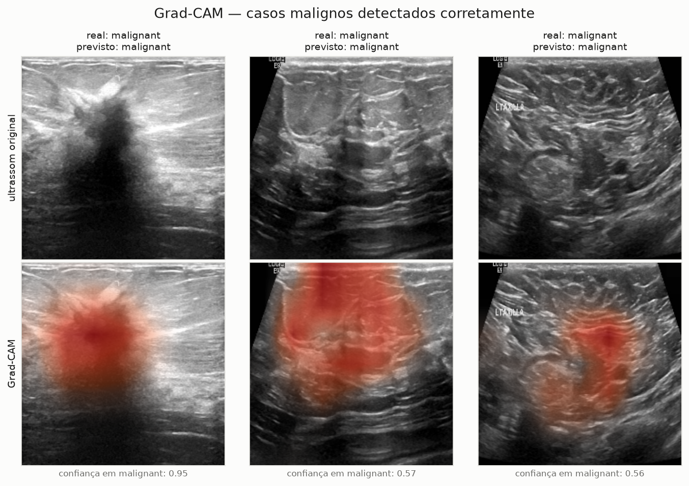

Nos casos detectados corretamente, **o calor se concentra sobre a lesão**. No primeiro, a massa
hipoecoica central é exatamente a região que sustenta a previsão, com 0,95 de confiança. Nos outros
dois, a atenção cobre a área da lesão e sua vizinhança imediata. O modelo está olhando para o lugar
certo — o que não era garantido, e é justamente o que a explicabilidade existe para verificar.

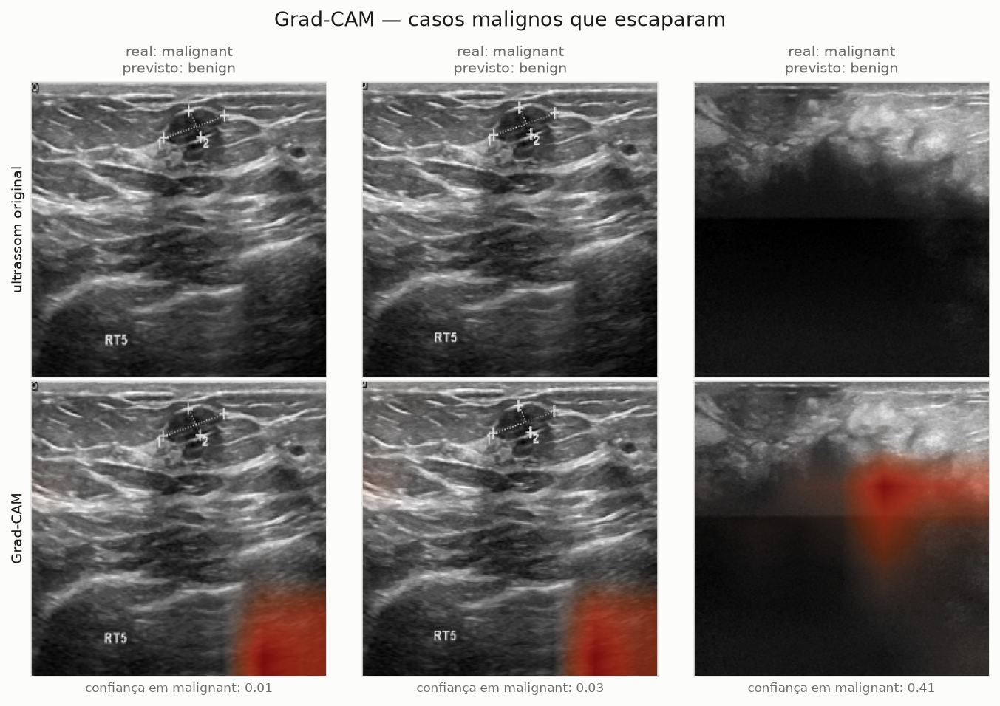

Nos casos que escaparam, o padrão se inverte de forma reveladora: **a lesão permanece fria e o calor
migra para o canto inferior direito**, uma região de sombra acústica sem relevância diagnóstica. O
modelo não avaliou mal a lesão — ele não a considerou. A confiança na classe maligna despenca para
0,01 e 0,03.

Duas observações adicionais nessas imagens. Elas trazem **anotações gravadas em pixel** — marcadores
de medição em cruz, linha pontilhada e etiqueta de posição — feitas pelo profissional que já
identificou a lesão suspeita. Essas marcas carregam informação do diagnóstico, e uma rede que
aprendesse a reconhecê-las teria desempenho alto e valor clínico nulo, porque em um exame novo elas
não existem. Os mapas mostram que, ao menos nestes casos, a atenção não se fixa nelas.

E as duas primeiras colunas são o **mesmo exame**, em quadros quase idênticos. Aparecem juntas no
conjunto de teste porque o agrupamento descrito na seção 7.2 as manteve inseparáveis — antes da
correção, teriam sido distribuídas entre treino e teste.

Um defeito encontrado durante esta etapa merece registro, porque é sutil e silencioso. A
normalização da MobileNetV2 era aplicada como chamada de função durante a construção do modelo. Uma
função aplicada ao tensor é absorvida pelo grafo e **não aparece na lista de camadas** — o Grad-CAM,
que percorre as camadas, pulava a normalização e alimentava a rede com pixels de 0 a 255 onde ela
espera valores de −1 a 1. Os mapas resultantes eram ruído com aparência plausível, e as
probabilidades exibidas ficavam abaixo de 1/3 em um problema de três classes, o que é
matematicamente impossível para a classe prevista. A normalização passou a ser declarada como
camada, e um teste agora exige que percorrer as camadas reproduza exatamente a saída de `predict`.

### 7.7 Comparação honesta entre as duas entregas

| | Wisconsin (tabular) | BUSI (imagem) |
|---|---|---|
| Entrada | 30 medidas extraídas por especialista | pixels do exame |
| Recall da classe maligna | 0,929 | 0,900 |
| Amostras | 569 | 780 (668 exames distintos) |
| Dependência humana prévia | alta — exige medição manual | nenhuma |
| Explicabilidade | coeficientes, permutação e SHAP | Grad-CAM sobre a imagem |

O modelo tabular ainda leva vantagem nas métricas, mas resolve um problema mais fácil: recebe
medidas que um profissional já extraiu. O modelo de imagem opera sobre o dado bruto, sem etapa
manual anterior — mais próximo de um sistema de triagem real, e mais longe de estar pronto.

Com recall de 0,900, **1 em cada 10 tumores malignos ainda escaparia**. É um resultado adequado a
uma demonstração de viabilidade acadêmica e insuficiente para uso clínico, ainda que como triagem.
Os caminhos conhecidos para melhorar — mais dados, resolução maior, validação cruzada em vez de
partição única, ajuste de limiar por classe e remoção das anotações gravadas nas imagens — estão
fora do escopo desta fase. Nenhum deles contradiz a conclusão da seção 6: o médico continua com a
palavra final.
